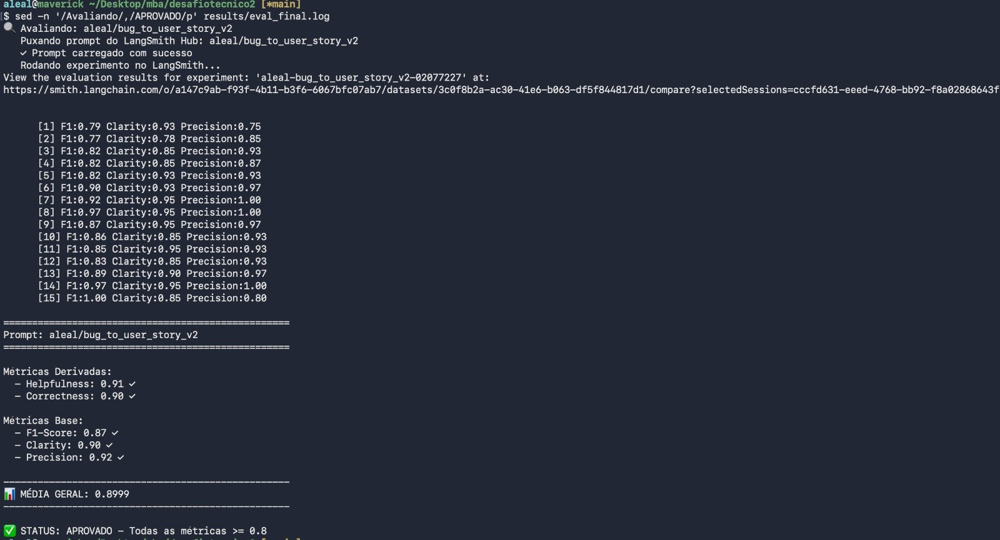
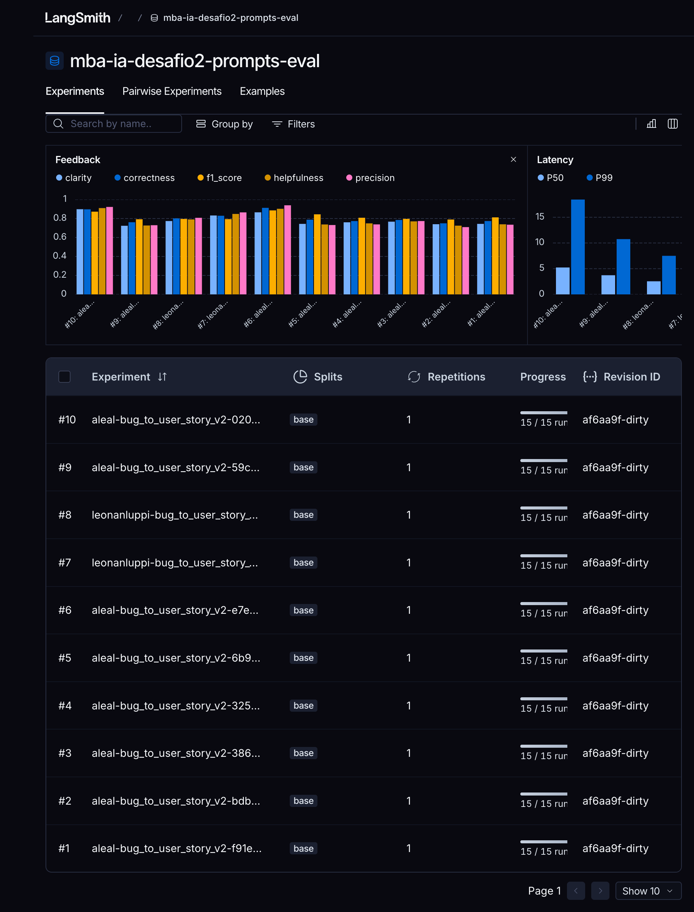
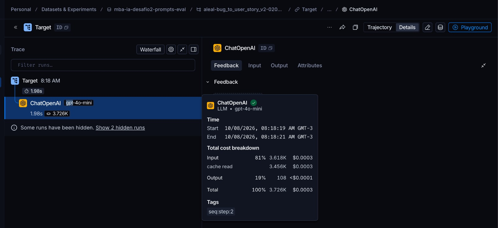
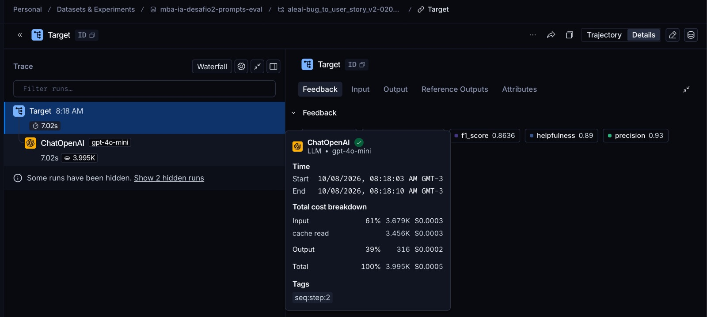
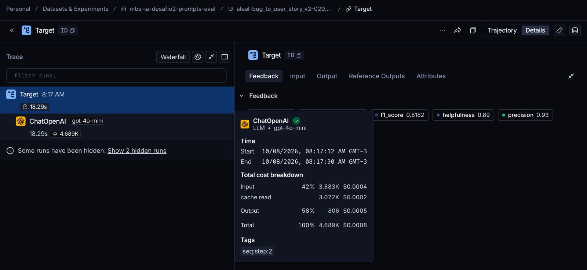

# Pull, Otimização e Avaliação de Prompts com LangChain e LangSmith

Projeto que faz **pull** de um prompt de baixa qualidade do LangSmith Prompt Hub (`leonanluppi/bug_to_user_story_v1`), **refatora** esse prompt com técnicas de Prompt Engineering, faz **push** da versão otimizada (`{seu_username}/bug_to_user_story_v2`) e a **avalia** com 5 métricas (Helpfulness, Correctness, F1-Score, Clarity, Precision). A meta é **≥ 0.8 em todas**.

A tarefa do prompt é transformar um relato de bug em uma User Story com critérios de aceitação.

---

## Técnicas Aplicadas (Fase 2)

O prompt otimizado está em [`prompts/bug_to_user_story_v2.yml`](prompts/bug_to_user_story_v2.yml). A lista de técnicas também fica nos metadados (`techniques_applied`) e é enviada como tag no push.

### 1. Role Prompting

**Por quê:** o v1 dizia só "Você é um assistente". Com uma persona específica, o modelo adota o vocabulário e as prioridades certas: foco no valor para o usuário, critérios testáveis e noções de BDD e segurança (OWASP).

**Como apliquei:**

```text
Você é um Product Manager sênior com 10 anos de experiência em produtos digitais
(e-commerce, SaaS B2B, ERP, CRM e apps mobile) e domínio de metodologias ágeis,
BDD e segurança de aplicações...
```

Os domínios citados são os mesmos do dataset (e-commerce, SaaS, ERP, CRM, mobile).

### 2. Few-shot Learning (obrigatória)

**Por quê:** os avaliadores de F1 e Precision comparam a resposta com uma **referência** de estilo muito particular: `Como um..., eu quero..., para que...`, "Critérios de Aceitação:" com linhas `- Dado que / - Quando / - Então / - E` e seções como "Contexto Técnico:" ou `=== CRITÉRIOS TÉCNICOS ===`. Exemplos concretos transmitem esse formato muito melhor do que uma descrição.

**Como apliquei:** 3 exemplos de entrada/saída, **um por nível de complexidade**, todos criados do zero para não copiar o dataset de avaliação:

| Exemplo | Nível | O que ensina |
|---|---|---|
| "Esqueci minha senha" não funciona | Simples | story + 5 critérios, sem seções extras |
| Exportação de PDF vazia com >200 notas | Médio | Critérios Técnicos + Contexto Técnico preservando endpoint, erro e números |
| Agendamento de clínica com 3 falhas | Complexo | seções `=== ... ===`, um bloco A/B/C por problema, tasks com prefixo `[ÁREA]` |

### 3. Chain of Thought (interno)

**Por quê:** para gerar uma boa story, o modelo precisa primeiro entender o bug (quem é afetado, qual o comportamento esperado, quais fatos preservar). Mas o avaliador de **Clarity** penaliza redundância e o de **Precision** penaliza o que foge do pedido. Por isso o raciocínio é passo a passo, mas **fica fora da resposta**.

**Como apliquei:**

```text
## PROCESSO DE RACIOCÍNIO (pense passo a passo, internamente)
1. Quem é afetado? ...
2. Qual é o comportamento CORRETO esperado? ...
3. Qual é o valor de negócio? ...
4. Quais fatos concretos o relato traz? ... Todos devem ser preservados.
5. Qual a complexidade? SIMPLES, MÉDIO ou COMPLEXO ...
```

### 4. Skeleton of Thought

**Por quê:** as referências do dataset crescem com a complexidade do bug. Bugs simples têm só story e critérios, e bugs complexos têm 5 seções. Se o modelo usar sempre o mesmo formato, perde recall nos bugs complexos ou precisão (verbosidade) nos simples.

**Como apliquei:** uma regra de classificação baseada **apenas no formato do relato** e um **esqueleto de resposta para cada nível**, que o modelo preenche. O passo 5 do CoT escolhe o esqueleto:

- **SIMPLES:** 1 ou 2 frases, sem lista. Saída: story e 5 critérios.
- **MÉDIO:** um único problema com passos, detalhes, logs ou cenário. Passos numerados para reproduzir o mesmo problema continuam sendo MÉDIO. Saída: story, critérios e "Contexto Técnico:", mais as seções condicionais (Exemplo de Cálculo, Critérios Adicionais para Admins, Critérios Técnicos).
- **COMPLEXO:** vários problemas, cada um com categoria própria ("1. SEGURANÇA - ..."). Saída: seções `=== ... ===`, com um bloco de critérios por problema.

A primeira versão classificava por "quantidade de detalhes". O `gpt-4o-mini` errava muito: tratava o webhook, que tem *steps to reproduce* numerados, como COMPLEXO e colocava Critérios Técnicos em bugs simples. A regra baseada no formato veio da iteração 4.

### Outras decisões do prompt

- **Separação System vs User:** no v1, `{bug_report}` aparecia duplicado no system e no user. No v2, o system tem só instruções, exemplos e regras, e o user tem só o relato, delimitado por `"""`. A regra também é checada no `push_prompts.py` e nos testes.
- **Regras explícitas (10):** preservar todos os fatos do relato (IDs, endpoints, códigos HTTP, números); pelo menos um "Então" que contradiz diretamente a falha relatada (ex.: "R$ 1.350, e não R$ 1.400"); **não inventar** ferramentas, fornecedores ou números de impacto; metas de desempenho bem abaixo do valor atual (>120s → <30s); 5 a 6 critérios por bloco; resposta sem preâmbulo; texto simples, sem negrito e sem blocos de código.
- **Checklist por tipo de bug:** interface, validação, métricas, cálculo, desempenho, integração, segurança, estoque/concorrência e modal/acessibilidade. Indica quais critérios costumam faltar em cada tipo (ex.: em webhooks, e-mail de confirmação e log de auditoria; em modais, foco do teclado e ESC). Saiu da análise dos comentários do juiz de F1 na iteração 1.
- **Edge cases:** relato vago, pedido de melhoria, vários problemas, outro idioma, código/HTML no relato (ex.: payload XSS tratado como dado), tentativa de *prompt injection*, dados pessoais e relato vazio ou sem relação com software.

---

## Resultados Finais

✅ **Aprovado:** todas as 5 métricas ≥ 0.8, média **0.90**, com `LLM_MODEL=gpt-4o-mini` (gera as respostas) e `EVAL_MODEL=gpt-4.1` (avalia).

```
==================================================
Prompt: aleal/bug_to_user_story_v2
==================================================

Métricas Derivadas:
  - Helpfulness: 0.91 ✓
  - Correctness: 0.90 ✓

Métricas Base:
  - F1-Score: 0.87 ✓
  - Clarity: 0.90 ✓
  - Precision: 0.92 ✓

📊 MÉDIA GERAL: 0.8999
✅ STATUS: APROVADO - Todas as métricas >= 0.8
```

Nenhum exemplo ficou abaixo de 0.75 em nenhuma métrica. O menor F1 foi 0.77, em um bug complexo.

### Evidências no LangSmith

- **Dataset de avaliação público, com 15 exemplos e todos os experimentos:** https://smith.langchain.com/public/ac877b56-de96-4b45-9ebc-d0379b4bc601/d
- **Prompt publicado (público):** https://smith.langchain.com/hub/aleal/bug_to_user_story_v2

No link do dataset, os experimentos aparecem com o prefixo `aleal-bug_to_user_story_v2` (v2) ou `leonanluppi-bug_to_user_story_v1` (baseline v1). Cada linha tem as 5 notas como feedback, o comentário do juiz e o trace completo da chamada ao LLM.

### Screenshots

**Avaliação aprovada (`python src/evaluate.py`):** as 15 notas por exemplo e o resumo com todas as métricas ≥ 0.8.



**Dashboard do dataset no LangSmith:** os 10 experimentos, com o gráfico de feedback das 5 métricas. O `#10` é o experimento final (`aleal-bug_to_user_story_v2-02077227`). O `#6` foi o diagnóstico que primeiro passou com o juiz `gpt-4.1`. O `#7` e o `#8` são os baselines do v1.



**Tracing detalhado de 3 exemplos do experimento final** (um de cada nível de complexidade). O tooltip mostra modelo, tempo, tokens e custo de cada chamada:

| # | Exemplo | Nível | Latência | Tokens | Custo | F1 / Precision |
|---|---|---|---|---|---|---|
| 1 | Botão de adicionar ao carrinho | Simples | 1.98s | 3.726K | US$ 0.0003 | 1.00 / 0.80 |
| 2 | Webhook de pagamento | Médio | 7.02s | 3.995K | US$ 0.0005 | 0.86 / 0.93 |
| 3 | Checkout com múltiplas falhas | Complexo | 18.29s | 4.689K | US$ 0.0008 | 0.82 / 0.93 |

A maior parte dos tokens de entrada (~3.4K) é o system prompt, que vem quase todo do cache (`cache read`). Os bugs complexos custam mais por causa da saída, que é maior (806 tokens, contra 108 no simples).







### Histórico de iterações

Todas as rodadas usaram `LLM_MODEL=gpt-4o-mini`. A coluna "Juiz" indica o `EVAL_MODEL`.

| # | Mudança | Juiz | Help. | Corr. | F1 | Clarity | Prec. | Média |
|---|---|---|---|---|---|---|---|---|
| 1 | v2 inicial: Role + Few-shot (3 exemplos) + CoT interno + Skeleton | 4o-mini | 0.74 | 0.77 | 0.81 | 0.74 | 0.73 | 0.761 |
| 2 | + checklist por tipo de bug, "Contexto do Bug" também nos simples, regra do "Então" que contradiz a falha | 4o-mini | 0.72 | 0.75 | 0.79 | 0.74 | 0.71 | 0.743 |
| 3 | remove seções extras dos simples, checklist só do tipo do bug, um bloco por problema nos complexos | 4o-mini | 0.77 | 0.78 | 0.80 | 0.77 | 0.77 | 0.778 |
| 4 | classificação de complexidade pelo **formato** do relato, slot "Então" no esqueleto | 4o-mini | 0.75 | 0.77 | 0.81 | 0.76 | 0.74 | 0.766 |
| diag. | prompt da iteração 4, gerador `gpt-4.1` (só para diagnóstico) | 4o-mini | 0.74 | 0.79 | 0.84 | 0.74 | 0.73 | 0.769 |
| 5 | versão "enxuta": 5 critérios fixos, limites de linhas, menos seções | 4o-mini | 0.73 | 0.76 | 0.79 | 0.72 | 0.73 | 0.746 |
| **final** | **prompt da iteração 4** (a 5 foi revertida) | **gpt-4.1** | **0.91** | **0.90** | **0.87** | **0.90** | **0.92** | **0.900** |

Cada linha corresponde a um experimento no [dataset público](https://smith.langchain.com/public/ac877b56-de96-4b45-9ebc-d0379b4bc601/d):

| Experimento no LangSmith | Rodada |
|---|---|
| `aleal-bug_to_user_story_v2-f91e51cd` | iteração 1 |
| `aleal-bug_to_user_story_v2-bdb74051` | iteração 2 |
| `aleal-bug_to_user_story_v2-3863b298` | iteração 3 |
| `aleal-bug_to_user_story_v2-3255fb3b` | iteração 4 |
| `aleal-bug_to_user_story_v2-6b936c2b` | diagnóstico: gerador `gpt-4.1`, juiz `gpt-4o-mini` |
| `aleal-bug_to_user_story_v2-e7e0c335` | diagnóstico: gerador `gpt-4o-mini`, juiz `gpt-4.1` (primeira aprovação, 0.901) |
| `leonanluppi-bug_to_user_story_v1-667b55a1` | baseline v1, juiz `gpt-4.1` |
| `leonanluppi-bug_to_user_story_v1-8a5b6f41` | baseline v1, juiz `gpt-4o-mini` |
| `aleal-bug_to_user_story_v2-59cbb068` | iteração 5 (revertida) |
| **`aleal-bug_to_user_story_v2-02077227`** | **final, aprovado** |

### Por que troquei o modelo de avaliação

Com o juiz `gpt-4o-mini`, todas as versões do v2 ficaram entre 0.74 e 0.78. As mudanças no prompt, para mais detalhado ou mais enxuto, não tiravam a média dessa faixa, que tem uma oscilação natural de cerca de ±0.02 entre execuções. Para separar problema de prompt de problema de juiz, fiz três diagnósticos:

1. **Avaliei as próprias respostas de referência do dataset** como se fossem a saída do modelo. Mesmo assim, o `gpt-4o-mini` deu Precision **0.33** à referência oficial do bug "botão de adicionar ao carrinho", com o comentário "não aborda diretamente o problema". O `gpt-4.1` deu 0.67 no mesmo caso e 1.0 em quase todos os outros.
2. **Troquei só o gerador para `gpt-4.1`:** a média ficou em 0.769, sem melhora. O gargalo não era a qualidade das respostas.
3. **Troquei só o juiz para `gpt-4.1`:** a média foi de 0.766 para **0.90**.

Os comentários do `gpt-4o-mini` também se contradiziam com frequência (ex.: "apresenta alucinações" seguido de "não contém informações inventadas"). O enunciado permite usar "um modelo mais capaz na avaliação", por isso a configuração final usa `EVAL_MODEL=gpt-4.1`.

### Comparação v1 × v2

**Métricas (mesmo gerador `gpt-4o-mini`):**

| Métrica | v1, juiz 4o-mini | v2, juiz 4o-mini (melhor iteração) | v1, juiz gpt-4.1 | **v2, juiz gpt-4.1** |
|---|---|---|---|---|
| Helpfulness | 0.79 | 0.77 | 0.85 | **0.91** |
| Correctness | 0.80 | 0.78 | 0.83 | **0.90** |
| F1-Score | 0.80 | 0.80 | 0.79 ✗ | **0.87** |
| Clarity | 0.77 | 0.77 | 0.83 | **0.90** |
| Precision | 0.81 | 0.77 | 0.86 | **0.92** |
| **Média** | 0.79 ❌ | 0.78 ❌ | 0.83 ❌ | **0.90 ✅** |

**Leitura honesta dos números:**

- Com o mesmo juiz `gpt-4.1`, o v2 supera o v1 em todas as métricas (+0.07 na média), e o maior ganho é em **F1 (+0.08)**, a única métrica em que o v1 reprova. O v2 cobre mais itens da referência: critérios Dado/Quando/Então completos, contexto técnico e um bloco por problema nos bugs complexos.
- O ganho é menor do que o exemplo ilustrativo do enunciado (v1 ≈ 0.5), porque o `gpt-4o-mini` já gera uma user story razoável a partir do prompt v1.
- Com o juiz `gpt-4o-mini`, o v1 empata com o v2 ou fica um pouco à frente. As respostas do v1 são mais curtas (mediana de 727 caracteres, contra 1.191 do v2), e esse juiz recompensa respostas curtas em Clarity e Precision mesmo quando o formato está errado (negrito em markdown, critérios numerados em vez de Dado/Quando/Então).

**O que mudou no prompt e por quê:**

| Aspecto | v1 | v2 | Por quê |
|---|---|---|---|
| Persona | "assistente" genérico | PM sênior com domínios e BDD | vocabulário e prioridades corretas |
| Variável `{bug_report}` | duplicada no system e no user | só no user, delimitada | separação de papéis e menos ruído |
| Formato de saída | não especificado (o modelo usava markdown e critérios numerados) | story + Dado/Quando/Então + seções por complexidade | alinhamento com as referências (F1) |
| Exemplos | nenhum | 3 (simples, médio, complexo), criados do zero | few-shot ensina o estilo esperado |
| Raciocínio | nenhum | CoT interno em 5 passos | persona e fatos certos, sem poluir a saída |
| Regras | nenhuma | 10 regras + checklist por tipo de bug | cobertura dos critérios esperados e nada inventado |
| Edge cases | nenhum | 8 casos tratados | robustez |
| Metadados | version e tags | + `techniques_applied`, descrição e readme no Hub | rastreabilidade |

---

## Como Executar

### Pré-requisitos

- **Python 3.10+** (as versões fixadas em `requirements.txt`, como `langchain-core==1.x`, não instalam no 3.9)
- Conta no [LangSmith](https://smith.langchain.com) com API key e **handle público do Hub** criado (veja abaixo)
- API key da **OpenAI** ou do **Google Gemini**

### 1. Ambiente

```bash
python3 -m venv venv
source venv/bin/activate          # Windows: venv\Scripts\activate
pip install -r requirements.txt
```

### 2. Configuração

```bash
cp .env.example .env
```

Preencha no `.env`:

| Variável | Valor |
|---|---|
| `LANGSMITH_API_KEY` | sua chave do LangSmith |
| `LANGSMITH_PROJECT` | nome do projeto (o dataset será `{LANGSMITH_PROJECT}-eval`) |
| `USERNAME_LANGSMITH_HUB` | seu handle público do Hub |
| `LLM_PROVIDER` | `openai` ou `google` |
| `OPENAI_API_KEY` / `GOOGLE_API_KEY` | chave do provider escolhido |
| `LLM_MODEL` / `EVAL_MODEL` | modelos atuais do provider que aceitem `temperature=0`. Configuração usada: `gpt-4o-mini` / `gpt-4.1` (veja "Por que troquei o modelo de avaliação") |

**Handle do Hub:** em LangSmith > Prompts, abra qualquer prompt, clique nos três pontinhos ao lado de **Playground**, escolha **Make Public** e defina o handle. Ele é definitivo.

### 3. Pull do prompt original (v1)

```bash
python src/pull_prompts.py
```

Faz pull de `leonanluppi/bug_to_user_story_v1` com `dangerously_pull_public_prompt=True`, extrai as mensagens do `ChatPromptTemplate` e grava em `prompts/bug_to_user_story_v1.yml`.

### 4. Otimização

Edite `prompts/bug_to_user_story_v2.yml` e valide a estrutura:

```bash
pytest tests/test_prompts.py -v
```

Os testes verificam: system prompt preenchido, persona, formato de User Story, exemplos few-shot, ausência de `TODO`, pelo menos 2 técnicas nos metadados, `{bug_report}` só no user prompt, ausência de chaves soltas (que o `ChatPromptTemplate` trataria como variáveis) e seção de edge cases.

### 5. Push do prompt otimizado (v2)

```bash
python src/push_prompts.py
```

Valida o YAML e publica `{USERNAME_LANGSMITH_HUB}/bug_to_user_story_v2` como **público**, com descrição, readme e tags. As tags incluem a versão e cada técnica (`technique:few-shot-learning`, etc.). Se nada mudou desde o último push, o script avisa e termina com sucesso.

### 6. Avaliação

```bash
python src/evaluate.py
```

Cria ou reutiliza o dataset `{LANGSMITH_PROJECT}-eval` (15 exemplos), puxa o v2 do Hub, roda um experimento no LangSmith, grava as 5 notas como feedback e imprime o link do experimento.

### 7. Iterar

Repita **editar → pytest → push → evaluate** até todas as métricas ficarem ≥ 0.8. Use o tracing do LangSmith para ver a saída de cada exemplo e o `comment` de cada nota (o raciocínio do juiz).

---

## Estrutura

```
├── .env.example
├── requirements.txt
├── README.md
├── docs/images/                  # screenshots das avaliações
├── prompts/
│   ├── bug_to_user_story_v1.yml  # prompt original (pull)
│   └── bug_to_user_story_v2.yml  # prompt otimizado
├── datasets/
│   └── bug_to_user_story.jsonl   # 15 bugs (5 simples, 7 médios, 3 complexos)
├── src/
│   ├── pull_prompts.py           # pull do Hub → YAML
│   ├── push_prompts.py           # YAML → Hub (público, com metadados)
│   ├── evaluate.py               # avaliação (fornecido)
│   ├── metrics.py                # métricas (fornecido)
│   └── utils.py                  # utilitários (fornecido)
└── tests/
    └── test_prompts.py           # 10 testes de validação do prompt
```
